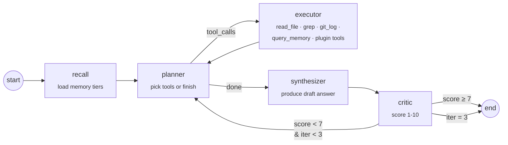
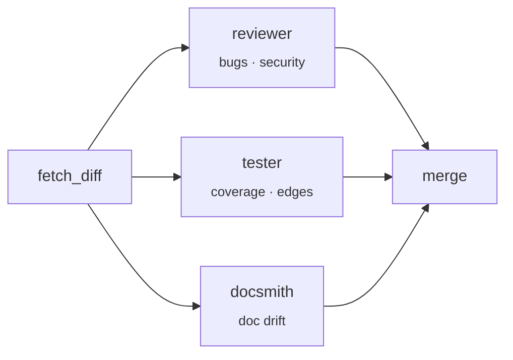
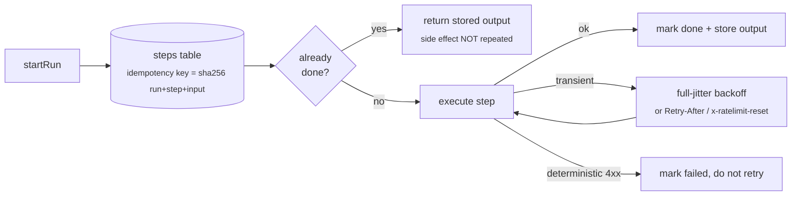

# mnex

<div align="center">

**A cognitive-architecture-inspired AI coding agent that lives in your terminal.**

[](https://www.npmjs.com/package/@vaibhav_dangaich/mnex)
[](https://github.com/VaibhavDangaich/MNEX/actions/workflows/ci.yml)
[](https://opensource.org/licenses/MIT)
[](#)

*Persistent multi-layer memory · stateful LangGraph agent · causal work graph · durable orchestration · local-first routing · GitHub integration · eval harness · plugin SDK*

</div>

---

## Why this exists

Most "AI coding assistants" are stateless Q&A wrappers. Every conversation starts from zero. They don't know what you were doing five minutes ago, they can't tell you *why* you last touched a file, and they don't learn from the suggestions you've rejected.

This project treats the agent as a **cognitive system**, not a chatbot:

- A **multi-tier memory** architecture (episodic → working → semantic → causal) that mirrors how humans actually reason.
- A **stateful LangGraph agent** with a planner → executor → critic loop, so the agent can *decide to fetch more context* before answering.
- A **causal work graph** in SQLite: every edit, command, commit, and conversation is a node; edges capture `preceded_by`, `caused_by`, `resolved`.
- A **local-first router** that uses Ollama / pure memory lookups for cheap queries and only escalates to the cloud when needed.
- A **durable orchestration engine** — long operations are checkpointed step-by-step in SQLite, so an interrupted run resumes instead of restarting.
- A **preference learning loop** (DPO-exportable) that adapts to *your* feedback on suggestions.
- An **evaluation harness** with baseline diffs, so prompt changes don't silently regress.
- An **observability layer** (SQLite-backed telemetry of every LLM call: tokens, cost, latency, route).
- A **plugin SDK** — drop `~/.mnex/plugins/*.js` and register tools, memory sources, and lifecycle hooks.

It is a single `npm i -g` binary. No server, no container, no database to run: every tier — the causal graph, the telemetry, the workflow log — is an embedded SQLite file, and the CLI works offline.

---

## Architecture

```
┌──────────────────────────────────────────────────────────────────────────────┐
│                              mnex                                    │
├──────────────────────────────────────────────────────────────────────────────┤
│                                                                              │
│   ┌─────────────────┐      ┌──────────────────────┐     ┌────────────────┐   │
│   │  Ambient Sensors│      │  LangGraph Agent     │     │  Observability │   │
│   │                 │      │                      │     │                │   │
│   │  • shell hook   │ ───▶ │  recall  ─► planner  │ ──▶ │  obs/telemetry │   │
│   │  • filewatcher  │      │                │     │     │  (SQLite WAL)  │   │
│   │  • focus state  │      │                ▼     │     └────────────────┘   │
│   │                 │      │           executor   │                          │
│   └────────┬────────┘      │                │     │     ┌────────────────┐   │
│            │               │                ▼     │     │ Preference log │   │
│            ▼               │            synthesiz │ ◀── │ (few-shot /    │   │
│   ┌─────────────────┐      │                │     │     │  DPO export)   │   │
│   │   Memory Tiers  │      │                ▼     │     └────────────────┘   │
│   │                 │ ◀──  │             critic   │                          │
│   │ episodic  (3h)  │      │             │   ▲    │     ┌────────────────┐   │
│   │ working (sess.) │      │             ▼   │    │     │ Plugin SDK     │   │
│   │ local   (proj.) │      │          (loop back) │ ◀── │ ~/.mnex/       │   │
│   │ semantic(cloud) │      └──────────────────────┘     │   plugins/*.js │   │
│   │ causal  (graph) │                                   └────────────────┘   │
│   └─────────────────┘                                                        │
│                                                                              │
│   ┌──────────────────────────────────────────────────────────────────────┐   │
│   │  Router:  trivial → memory-only  ·  simple → Ollama  ·  complex → cloud  │
│   └──────────────────────────────────────────────────────────────────────┘   │
└──────────────────────────────────────────────────────────────────────────────┘
```

### The LangGraph agent (critic loop)



Nodes live in [`core/agent/graph.js`](core/agent/graph.js). The planner and critic are themselves LLM calls, but are tracked in observability as distinct `node` tags (`agent.planner`, `agent.critic`, `agent.synthesizer`) so you can see per-node latency and cost.

### Multi-agent review (parallel fan-out)



Three specialists run in parallel against `git diff HEAD` (or any ref) via `mnex review`. Implemented in [`core/agent/review.js`](core/agent/review.js).

### Causal work graph

Flat event logs can't answer *"why did I touch `auth.js` last Tuesday?"*. The causal graph promotes the event stream into a typed graph:

```
(commit "fix login")
      │ includes
      ▼
(edit auth.js save)  ──preceded_by──►  (cmd "npm test")  ──preceded_by──►  (error "exit 1")
      ▲
      │ referenced_in
(conversation "why is auth failing")
```

Schema (SQLite + FTS5), ingestion hooks, and a natural-language → SQL query layer live in [`core/memory/causal.js`](core/memory/causal.js).

---

## Durable orchestration

Indexing a GitHub account is the longest thing mnex does — one pass over 50+ repos is hundreds of API calls and runs for minutes. That is long enough to be interrupted by `^C`, a closed laptop, a dropped connection, or a rate limit. Restarting from zero re-fetches and re-stores every repo that already succeeded.

Every long operation is now a **durable run**: a write-ahead step log in SQLite. Each step is recorded *before* its side effect and marked terminal after, so an interrupted run resumes from the first step that did not finish.



```bash
$ mnex github --index --max 55
   [1/55] repo:VaibhavDangaich/Sagepilot
   [2/55] repo:VaibhavDangaich/Context_graph
   ↻ repo:VaibhavDangaich/Portfolio: attempt 1 failed, retrying in 2s
   [3/55] repo:VaibhavDangaich/Portfolio
   ^C

$ mnex github --resume
   [1/55] repo:VaibhavDangaich/Sagepilot (already done, skipped)
   [2/55] repo:VaibhavDangaich/Context_graph (already done, skipped)
   [4/55] repo:VaibhavDangaich/MNEX
   ...
   ✅ newly indexed: 52   ⏭️ skipped: 3
```

**Design decisions, and why:**

| Decision | Rationale |
|---|---|
| Embedded, not Temporal.io / DBOS / Convex | Every general-purpose durable runtime needs a server or hosted backend. mnex is a globally-installed CLI that must work offline. The engine adds **no daemon, no port, and no resident memory** — it is a table in a SQLite file that is open only while a command runs. |
| Idempotency key = `sha256(run + step + canonical input)` | Object keys are sorted before hashing, so `{a,b}` and `{b,a}` are the same step. This is what makes resume safe for side-effecting work: a completed step returns its stored output and its body is never called again. |
| Full-jitter backoff | `random(0, min(cap, base·2ⁿ))`. Plain exponential backoff makes every interrupted client retry in lockstep. |
| Server pacing wins over local backoff | If a response carries `Retry-After`, or `x-ratelimit-remaining: 0` with `x-ratelimit-reset`, that is obeyed instead of the computed delay. |
| 4xx fails fast | `404`/`422`/`401` are deterministic. Retrying them only burns the GitHub rate-limit budget. Only `429` and `5xx` (and transport errors like `ECONNRESET`) retry. |

Engine: [`core/orchestration/engine.js`](core/orchestration/engine.js). Behaviour is covered by [`test/orchestration.test.js`](test/orchestration.test.js), including the property that matters — *a resumed run does not re-execute completed steps*.

### Swapping in Temporal.io

The embedded engine is the default because a globally-installed CLI shouldn't require a server. Teams that **already run Temporal** can opt in and get its event history, visibility UI and operational tooling instead — without any calling code changing.

```bash
npm i @temporalio/client @temporalio/worker @temporalio/workflow @temporalio/activity
export MNEX_ORCHESTRATOR=temporal
mnex workflow doctor          # verifies client → server → worker → activity
mnex github --index --max 55
```

| | embedded *(default)* | temporal *(opt-in)* |
|---|---|---|
| Infrastructure | none | Temporal cluster or Temporal Cloud |
| Durability | SQLite step log + idempotency keys | Temporal event history |
| Node | ≥18 | ≥20.3 (SDK requirement) |
| Install weight | 0 (already bundled) | ~147 extra packages |
| Visibility | `mnex workflow show` | Temporal Web UI, `temporal workflow show` |
| Works offline | yes | no |

**What makes both backends interchangeable.** Temporal workflow code is replayed deterministically and runs in a sandbox, so it cannot capture a closure — it can only schedule work *by name*. Units of work are therefore declarative:

```js
{ name: "repo:acme/api", activity: "indexRepo", input: { owner: "acme", repo: "api" } }
```

The embedded engine resolves `activity` against [`core/orchestration/activities.js`](core/orchestration/activities.js) and calls it inline; the Temporal adapter hands the same descriptor to `proxyActivities`. Neither backend knows about the other.

**Credentials are never placed in workflow input.** Temporal persists workflow history, so a token in workflow arguments would be written to the Temporal datastore in the clear. Activities resolve secrets from local config at call time, and they execute in *your* worker process — so tokens stay on the machine running `mnex worker`. This is asserted in [`test/temporal.test.js`](test/temporal.test.js).

Worker lifecycle: `mnex github --index` starts an **ephemeral in-process worker** for the duration of the command, which is the right default for a CLI. For a shared cluster, run a long-lived `mnex worker` instead and the workflow will be picked up by that fleet.

#### Verified durability, not asserted

Run against a live dev server (`temporal server start-dev`) via [`scripts/verify/temporal-resume.js`](scripts/verify/temporal-resume.js) — it starts a worker, `SIGKILL`s it mid-run, starts a fresh one, and checks what re-executed:

```
1. starting worker A
2. starting workflow mnex-verify-1785517089700 (6 repos)
3. SIGKILL worker A — 3 completed, "repo3" in flight
4. starting worker B (fresh process)
==============================================================
workflow result       : 6 completed, 0 failed
distinct repos indexed: 6 of 6
worker PIDs involved  : 2  (survived a worker SIGKILL)
completed-then-rerun  : none  <-- must be none
in-flight retried     : repo3  <-- expected: the interrupted one
==============================================================
```

Note the honest result: the activity that was **in flight** when the worker died *was* retried, because its completion was never reported. Temporal activities are **at-least-once**, not exactly-once — only *completed* activities are never re-run. The embedded engine has the same property for a step left `in_flight` by a crash. This is why mnex activities are written to be idempotent (`supermemory.store` overwrites by key rather than appending).

### Durable outbound sync queue

`cloudsync` deliberately swallows failures so a flaky network never blocks the UI. That is right for UX and wrong for data: an offline edit was previously lost for good. Failed syncs now land in a durable outbox ([`core/remote/queue.js`](core/remote/queue.js)) with backoff, de-duplication, and a poison-payload drop after `maxAttempts`, and drain on the next invocation.

| Command | What it does |
|---|---|
| `mnex workflow` | List durable runs with per-run step progress. |
| `mnex workflow show --id <runId>` | Per-step status, attempt counts and errors. |
| `mnex workflow prune --days 30` | Delete finished runs and reclaim pages. |
| `mnex github --resume` | Resume the last interrupted index. |

---

## Footprint

mnex runs on your laptop, and the shell hook invokes it after **every command you type** — so startup cost is paid constantly, not occasionally.

The CLI previously required `core/prompt`, `core/llm`, `core/memory/conversation` and `core/monitor/terminal` at top level. Each transitively imports `@langchain/core`, so logging a shell command loaded an entire model stack it never used. Heavy modules are now loaded on first property access.

Measured on Node v25 (warm cache, mean of 8 runs; peak RSS via `/usr/bin/time -l`):

| Command | Before | After | Delta |
|---|---|---|---|
| `mnex log` *(runs after every shell command)* | 344 ms · 68.9 MB | **75 ms · 49.5 MB** | −78% time, −19.4 MB |
| `mnex --version` | 160 ms · 66.3 MB | **87 ms · 45.3 MB** | −46% time, −21.0 MB |
| `mnex status` | 267 ms · 68.5 MB | **169 ms · 48.7 MB** | −37% time, −19.8 MB |

`mnex log` no longer imports `@langchain/*` at all — asserted in [`test/startup.test.js`](test/startup.test.js), which checks the *import graph* rather than wall-clock time so it stays stable in CI.

Other footprint work:

- **The file watcher was walking `node_modules`.** chokidar dropped glob support in `ignored` at v4, which silently turned every `**/node_modules/**` pattern into a literal that never matched. `ignored` is now a predicate matching whole path segments (so `src/env.js` is not collateral-ignored). Verified end-to-end in [`test/watcher.test.js`](test/watcher.test.js).
- **SQLite tuning.** The causal and telemetry databases were WAL but had no `busy_timeout`, so a CLI invocation colliding with the background watcher raised `SQLITE_BUSY` instead of waiting. Added `busy_timeout`, `synchronous = NORMAL`, and `journal_size_limit` to cap `-wal` growth over long daemon uptimes.
- **Workflow log growth** is bounded by `mnex workflow prune`, which deletes finished runs and runs `wal_checkpoint(TRUNCATE)`.

To reproduce on your machine:

```bash
/usr/bin/time -l node bin/ai.js log --command "echo hi" --exit-code 0 --cwd /tmp 2>&1 >/dev/null \
  | awk '/maximum resident/{printf "peak RSS %.1f MB\n", $1/1048576}'
```

---

## Testing

```bash
npm test        # 58 unit tests (node:test) — no API key, no Temporal server required
npm run smoke   # module loading, CLI wiring, path resolution, packaging
```

The one test needing a real cluster is skipped unless `MNEX_TEMPORAL_ADDRESS` is set:

```bash
temporal server start-dev
MNEX_TEMPORAL_ADDRESS=localhost:7233 npm test     # 58/58, nothing skipped
node scripts/verify/temporal-resume.js            # crash-resume proof
```

Unit tests deliberately cover only what is deterministic without a model: the durable engine's replay and retry semantics, the outbox, path resolution, watcher ignore rules, startup import graph, and the read-only SQL guard. LLM behaviour is covered separately by the eval harness (`mnex eval run`), which does need a key.

The smoke test catches the class of breakage that unit tests miss — a module that fails to load, a documented command that no longer exists, a path that points where nothing writes, or a file missing from the published tarball. It caught a live bug on first run: the CLI hardcoded `.version("1.5.0")` while the package was `1.5.1`.

CI runs both on Node 18, 20 and 22 (plus macOS). Node 18 is in the matrix on purpose — it is the floor `package.json` advertises, and it is exactly where the chokidar-v5 ESM regression broke `require()`.

---

## Install

```bash
npm install -g @vaibhav_dangaich/mnex
mnex init                       # one-time: paste your OpenAI / Gemini key
mnex service start              # install shell hook, filewatcher, watcher daemon
```

Environment variables (alternatively edit `config/default.json`):

```bash
# one of the two
OPENAI_API_KEY=sk-...
GEMINI_API_KEY=...

# optional: cross-device semantic recall
SUPERMEMORY_API_KEY=...

# optional: local model routing
OLLAMA_URL=http://localhost:11434
OLLAMA_MODEL=llama3.2:3b
```

---

## Command reference

### Core conversation

| Command | What it does |
|---|---|
| `mnex ask "question"` | Default path — router picks memory / Ollama / cloud. |
| `mnex ask "..." --agent` | Use the LangGraph agent with critic loop. |
| `mnex ask "..." --agent --trace` | Same, but print the per-node execution trace. |
| `mnex ask "..." --route memory\|ollama\|cloud` | Force a route. |

### Work graph

| Command | What it does |
|---|---|
| `mnex graph stats` | Node/edge counts, broken down by type and relation. |
| `mnex graph search "<text>"` | FTS5 search across commits, edits, commands, conversations. |
| `mnex graph ask "<nl>"` | Natural-language → SQL query (read-only, sanitised). |

### Developer DNA

| Command | What it does |
|---|---|
| `mnex profile` | Markdown profile: languages, top commands, error patterns, productive hours, co-edited file pairs, frequent topics. |
| `mnex profile --json` | Same data, machine-readable. |

### Multi-agent review

| Command | What it does |
|---|---|
| `mnex review` | Three agents (reviewer, tester, docsmith) fan-out over `git diff HEAD`. |
| `mnex review -t main` | Diff against a specific ref. |

### Mutation gate

`mnex review` asks an LLM whether a change looks under-tested. `mnex mutate` settles it empirically: break the changed code on purpose, re-run the suite, and count how many breakages nobody noticed.

The problem it exists for is that coverage measures *execution*, not *verification* — a test can run every changed line while asserting nothing about any of them. It reads `git diff` and nothing else, so it is indifferent to what wrote the change: an agent, a teammate, or you at 2am.

| Command | What it does |
|---|---|
| `mnex mutate --dry-run` | Print the changed source lines a mutation run would target. |
| `mnex mutate -t main` | Scope against a specific ref instead of `HEAD`. |
| `mnex mutate --json` | Machine-readable scope, for CI. |

Formatting-only edits are excluded — the diff is taken twice, once with `-w --ignore-blank-lines`, and the two line sets intersected. Untracked files count as fully added, because an agent that writes a new file leaves it untracked until `git add` and answering "nothing to mutate" there would be actively misleading. An unresolvable ref fails loudly rather than reporting an empty scope; a gate that silently passes is worse than no gate.

**Status: preview, shipped in v1.6.** Diff scoping is live — `mnex mutate --dry-run` shows exactly which lines a run would target. Mutant generation, execution and the coverage-vs-mutation verdict land in the next releases.

### GitHub integration

| Command | What it does |
|---|---|
| `mnex github` | Show GitHub integration status and help. |
| `mnex github --repos` | List your repositories (requires `GITHUB_TOKEN`). |
| `mnex github --index` | Index all repos into Supermemory for semantic recall. |
| `mnex github --repo user/repo` | Index a specific repository. |
| `mnex github --index --max 20` | Index up to N repos. |
| `mnex github --index --starred` | Include starred repos in the index. |
| `mnex github --resume` | Resume an interrupted index without redoing completed repos. |

### Durable runs

| Command | What it does |
|---|---|
| `mnex workflow` | List durable runs and their step progress. |
| `mnex workflow show --id <runId>` | Per-step status, attempts and errors. |
| `mnex workflow prune --days 30` | Delete finished runs, reclaim pages. |
| `mnex workflow doctor` | Show the active backend; probe Temporal if selected. |
| `mnex worker` | Run a long-lived Temporal worker (opt-in backend only). |

Set `GITHUB_TOKEN` in your `.env` or `~/.mnex.env`. Generate one at `github.com/settings/tokens/new` (read-only scopes are sufficient).

### Evals

| Command | What it does |
|---|---|
| `mnex eval run` | Run the suite, diff against baseline, print pass/fail + latency + critic scores. |
| `mnex eval run --baseline` | Run and immediately save as the new baseline. |
| `mnex eval baseline` | Re-run and save without diffing. |
| `mnex eval add "question" --contains "keyword"` | Add a case. |

### Preference learning

| Command | What it does |
|---|---|
| `mnex suggest feedback <id> accept\|reject [reason]` | Rate the last agent answer (id printed after each `--agent` run). |
| `mnex suggest stats` | Accept/reject counts, DPO pair count. |
| `mnex suggest export` | Stream DPO-compatible JSONL (`{prompt, chosen, rejected}`) to stdout. |

### Observability

| Command | What it does |
|---|---|
| `mnex stats` | 7-day totals: calls, tokens, cost, latency, by route/model/day. |
| `mnex stats --days 30 --project myproj` | Window + project filter. |
| `mnex stats --recent 20` | Last N LLM calls. |

### Plugins

| Command | What it does |
|---|---|
| `mnex plugin list` | Show loaded plugins and what they register. |
| `mnex plugin scaffold <name>` | Create `~/.mnex/plugins/<name>.js` from a template. |

### Legacy / ambient

`mnex log`, `mnex remember`, `mnex task`, `mnex memory`, `mnex status`, `mnex history`, `mnex watch`, `mnex errors`, `mnex focus`, `mnex sync`, `mnex handoff`, `mnex service`, `mnex journal`, `mnex projects`, `mnex error`, `mnex decide`, `mnex learned`, `mnex snippet`, `mnex remind`, `mnex knowledge`, `mnex github`, `mnex supermemory`, `mnex init`, `mnex setup` — see `mnex --help`.

---

## Memory tiers in detail

| Tier | Store | TTL | Role |
|------|-------|-----|------|
| **Episodic** | `storage/episodic.json` | 3 hours | Raw stream of terminal commands and file edits. Cheap to query, fast to decay. |
| **Working** | `storage/working.json` | Session | Current task, recent errors, blockers, decisions — per project. |
| **Local semantic** | `storage/memory.json` | Permanent | Facts the user explicitly asked to remember (`mnex remember "..."`). |
| **Cloud semantic** | Supermemory | Permanent, cross-device | Vectorised memories for cross-device + cross-project recall. |
| **Causal graph** | `storage/causal.db` (SQLite WAL) | Permanent | Typed nodes + edges — the structural history of your work. |
| **Telemetry** | `storage/telemetry.db` | Permanent | Every LLM call (provider, model, tokens, cost, latency, node). |
| **Preferences** | `storage/preferences.json` | Permanent | Accept/reject history, few-shot injected into the planner. |
| **Workflow log** | `storage/workflows.db` | Pruned at 30d | Durable step log + outbound sync outbox. |

All JSON writes are **atomic** (write-to-temp-then-rename) to survive crashes mid-write. All SQLite tiers run in WAL with a `busy_timeout`, so the CLI and the background watcher can touch them concurrently without `SQLITE_BUSY`.

---

## Local-first routing

Every `mnex ask` starts with a heuristic classifier:

| Class | Signals | Routes to |
|-------|---------|-----------|
| **trivial** | "what did I", "list", "recent", "today" — and episodic memory has entries | Pure memory lookup (zero LLM cost). |
| **simple** | Short, single clause, no "implement/design/refactor" | Ollama (if running), else cloud. |
| **complex** | Contains `implement`, `design`, `refactor`, `algorithm`, `debug`, `review`… | Cloud. |

Override with `--route memory|ollama|cloud`. Classifier code: [`core/llm/router.js`](core/llm/router.js).

---

## Plugin SDK

Drop a file into `~/.mnex/plugins/<name>.js`:

```js
module.exports = {
    name: "jira",
    version: "1.0.0",

    // Agent-callable tools — namespaced as "jira.fetch_ticket"
    tools: {
        fetch_ticket: {
            description: "Fetch a Jira ticket. Args: { id: string }",
            async run({ id }) {
                const r = await fetch(`https://mycompany.atlassian.net/rest/api/3/issue/${id}`);
                const j = await r.json();
                return { ok: true, result: `${j.key}: ${j.fields.summary}` };
            },
        },
    },

    // Inject extra context into every `memory.recall(...)` call
    memorySource: async (project, query) => {
        if (!/PROJ-\d+/.test(query)) return null;
        return "Relevant Jira tickets: …";
    },

    // Lifecycle hooks
    hooks: {
        onStart(ctx)    { /* ... */ },
        onQuestion(q)   { /* ... */ },
        onCommand(evt)  { /* ... */ },
    },
};
```

Scaffold one: `mnex plugin scaffold jira`.

---

## Eval harness

Cases live in [`core/eval/cases.json`](core/eval/cases.json). Each case supports:

```json
{
  "id": "tool-use-1",
  "question": "How many commits are in this repo?",
  "expect": {
    "contains_any":    ["commit"],
    "contains_all":    ["main"],
    "contains_any_ci": ["refuse", "won't"],
    "tool_called_any": ["git_log", "grep"],
    "min_length":      20,
    "max_latency_ms":  15000
  }
}
```

Each run records: pass/fail, failure reasons, tools invoked, latency, critic score, iterations. Baseline diff surfaces regressions (changed verdict, or >50% latency growth).

```
$ mnex eval run
• self-1 … PASS  (2180ms, crit=9)
• self-2 … PASS  (2954ms, crit=8)
• recall-1 … PASS  (1711ms, crit=7)
• tool-use-1 … PASS  (4402ms, crit=10)
• refusal-1 … PASS  (1203ms, crit=9)

═══ Eval report ═══
Passed: 5/5   Failed: 0
Avg latency: 2490ms   Avg critic: 8.60
(no changes vs baseline)
```

---

## Observability

Every LLM call — planner, critic, synthesizer, ask, stream, review-reviewer, graph.nl2sql — is stamped with a `node` tag and recorded:

```
$ mnex stats --days 7

═══ LLM telemetry (last 7d) ═══
Calls:       142
Tokens:      389,412
Cost:        $0.3241
Avg latency: 1,820ms
Failures:    3

By route:
  cloud-direct    68 calls   $0.2019
  cloud-stream    42 calls   $0.1102
  agent           18 calls   $0.0120
  local           14 calls   $0.0000

By model:
  gpt-4o-mini     110 calls  $0.2431
  ollama          14  calls  $0.0000
  gemini-1.5-flash 18 calls  $0.0810
```

Records live in `storage/telemetry.db`. Pricing table is in [`core/obs/tracker.js`](core/obs/tracker.js) — update as providers change rates.

---

## Project layout

```
mnex/
├── bin/ai.js                   # CLI entry, command wiring (heavy deps lazy-loaded)
├── core/
│   ├── agent/
│   │   ├── graph.js            # LangGraph agent with critic loop (flagship)
│   │   ├── review.js           # Multi-agent code review (parallel fan-out)
│   │   ├── tools.js            # Agent-callable tools (read_file, grep, git_log, ...)
│   │   ├── profile.js          # Developer DNA / digital twin
│   │   ├── preferences.js      # Accept/reject → few-shot + DPO export
│   │   ├── proactive.js        # Spidey-sense file watcher
│   │   ├── journal.js, knowledge.js, reminders.js, crossproject.js
│   ├── memory/
│   │   ├── index.js            # Unified recall() — all tiers
│   │   ├── episodic.js         # Recent activity (JSON, atomic writes)
│   │   ├── working.js          # Session state (JSON, atomic writes)
│   │   ├── local.js            # Semantic facts (JSON, atomic writes)
│   │   ├── supermemory.js      # Cloud semantic search
│   │   ├── conversation.js     # Multi-turn context (JSON, atomic writes)
│   │   └── causal.js           # Causal work graph (SQLite + FTS5 + NL→SQL)
│   ├── orchestration/
│   │   ├── engine.js           # Durable step log: idempotency, retries, resume
│   │   ├── activities.js       # Named activity registry (shared by both backends)
│   │   ├── index.js            # Backend selection: embedded | temporal
│   │   └── temporal/           # Opt-in Temporal.io adapter + workflow definitions
│   ├── integrations/
│   │   └── github.js           # GitHub REST API — durable repo/issue/PR indexing
│   ├── remote/
│   │   └── queue.js            # Durable outbound sync queue (offline-safe)
│   ├── paths.js                # Single source of truth for config/data locations
│   ├── monitor/                # filewatcher, terminal hook, extractor, gitmonitor
│   ├── llm.js                  # LangChain provider wrapper (OpenAI / Gemini)
│   ├── llm/router.js           # Local-first router (trivial → Ollama → cloud)
│   ├── obs/tracker.js          # Telemetry (SQLite WAL)
│   ├── plugins/loader.js       # Plugin discovery & tool/memory/hook registry
│   ├── eval/
│   │   ├── cases.json          # Golden (question, expectation) suite
│   │   ├── runner.js           # Asserter + baseline diff
│   │   └── baseline.json       # (generated) snapshot of last baseline run
│   ├── service/manager.js      # launchd integration
│   ├── config.js, context.js, prompt.js
├── storage/                    # All runtime state (episodic, working, causal.db,
│                               #   telemetry.db, workflows.db, ...)
├── test/                       # node:test unit tests (no API key needed)
├── hooks/                      # Shell hook (zsh)
├── scripts/                    # Postinstall + smoke test
├── .github/workflows/ci.yml    # CI: Node 18/20/22 + macOS
├── vscode-extension/           # Companion VS Code extension
└── web/                        # Optional dashboard scaffold
```

### Where mnex keeps things on disk

| Path | Contents |
|---|---|
| `~/.config/mnex/.env` | API keys written by `mnex init`. |
| `~/.mnex.env` | Alternative key location; takes priority over the config dir. |
| `~/.mnex/plugins/*.js` | User plugins. |
| `<package>/storage/` | Databases and JSON tiers. |

All of these resolve through [`core/paths.js`](core/paths.js). Pre-rename locations (`~/.config/ai-agent`, `~/.ai-agent/plugins`) are still read and migrated on first access, so upgrading does not strand existing state.

---

## Security

- **Atomic writes** everywhere — no partial-write corruption.
- **`spawn`-only** for subprocesses, never `exec` with string interpolation. File paths, patterns, and notification text are passed as argv, so there's no shell injection surface.
- **Read-only SQL** — the NL→SQL graph query layer hands an LLM-authored string to the database, so it is guarded by [`assertReadOnlySql`](core/memory/causal.js): the statement must begin with `SELECT`/`WITH` and must not mention `INSERT/UPDATE/DELETE/DROP/ATTACH/DETACH/PRAGMA/ALTER/CREATE/REPLACE/VACUUM/REINDEX`. `REPLACE`, `VACUUM`, `REINDEX` and `DETACH` were missing from the original list. As defence in depth, better-sqlite3's `prepare()` independently rejects multi-statement strings, so `SELECT 1; DROP TABLE nodes` cannot execute even if the guard were bypassed. Both properties are asserted in [`test/security.test.js`](test/security.test.js).
- **API keys** read from `.env` or `~/.mnex.env` (user-scoped). Never logged to telemetry.
- **Plugin tools** can be sandboxed by simply not installing plugins you don't trust — they live in `~/.mnex/plugins/` and are loaded explicitly.

---

## Roadmap / what's next

The architecture leaves obvious next moves. The first three are the ones comparable tools already ship, so they are the most conspicuous gaps:

- **Context compaction** — summarise-and-truncate when a session approaches the token limit, as Claude Code (`/compact`) and Gemini CLI (`/compress`) do. Long sessions currently degrade rather than gracefully summarising.
- **Session-end consolidation** — distil a finished session into durable facts via a local Ollama call, the way Codex CLI's Memories and Windsurf's Cascade Memories do, and write them into the semantic tier.
- **Memory inspection commands** — `mnex memory show` / `mnex memory forget`, so what the agent believes is directly auditable and editable.
- **Fact invalidation** — close a validity window when a new fact contradicts an old one (Zep's temporal-knowledge-graph approach) instead of letting stale facts persist.
- **DPO fine-tune** a small local model using `mnex suggest export` pairs.
- **Embeddings over files** — semantic code search as an agent tool (beyond FTS5).
- **Team-shared memory** — the causal graph plus Supermemory already supports cross-device, but a shared "team tribal knowledge" layer is one auth hop away.
- **Dashboard UI** — `web/` has a Vercel scaffold; wire `mnex stats` and `mnex profile` JSON endpoints.
- **Finish the mutation gate** — `mnex mutate` scopes a diff today. Next: acorn-based mutant generation, an in-memory `--require` sandbox so no mutant ever touches the working tree, test selection by V8 coverage at the mutation offset, and a verdict that reports the gap between line coverage and mutation score on the changed lines.

---

## License

MIT — see [LICENSE](LICENSE).

Built by [@VaibhavDangaich](https://github.com/VaibhavDangaich).
