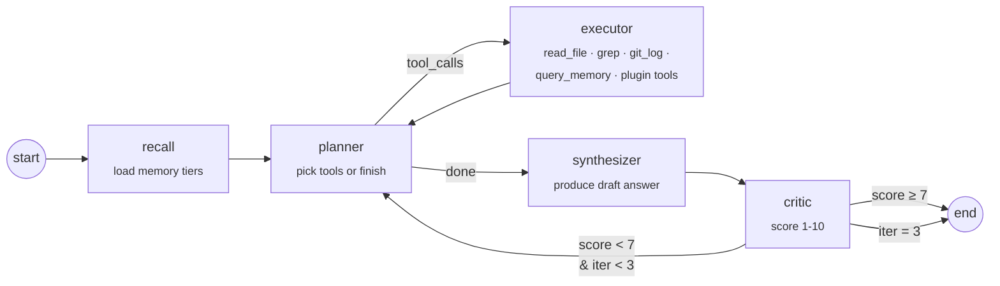
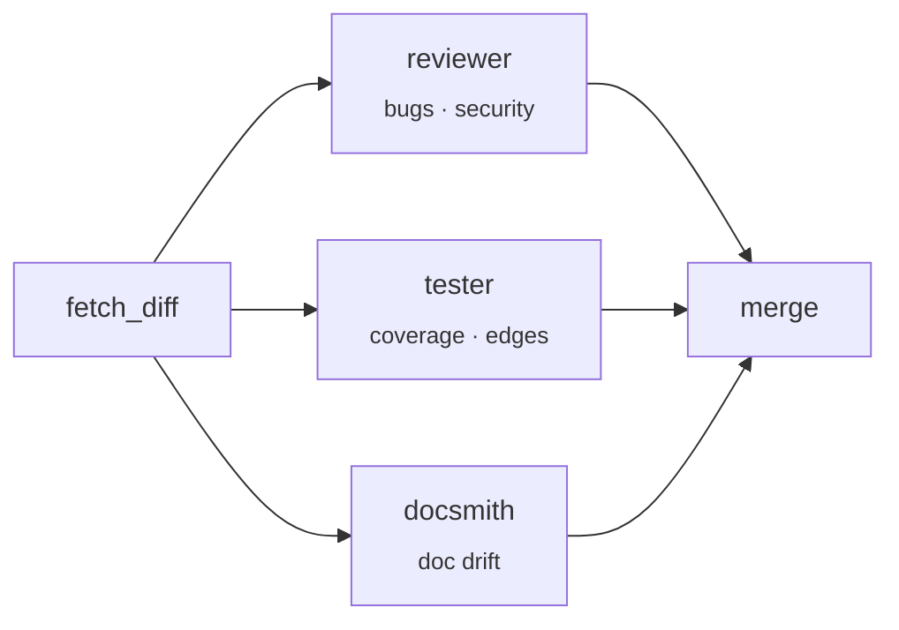

# mnex

<div align="center">

**A cognitive-architecture-inspired AI coding agent that lives in your terminal.**

[](https://www.npmjs.com/package/@vaibhav_dangaich/mnex)
[](https://opensource.org/licenses/MIT)
[](#)

*Persistent multi-layer memory · stateful LangGraph agent · causal work graph · local-first routing · GitHub integration · eval harness · plugin SDK*

</div>

---

## Why this exists

Most "AI coding assistants" are stateless Q&A wrappers. Every conversation starts from zero. They don't know what you were doing five minutes ago, they can't tell you *why* you last touched a file, and they don't learn from the suggestions you've rejected.

This project treats the agent as a **cognitive system**, not a chatbot:

- A **multi-tier memory** architecture (episodic → working → semantic → causal) that mirrors how humans actually reason.
- A **stateful LangGraph agent** with a planner → executor → critic loop, so the agent can *decide to fetch more context* before answering.
- A **causal work graph** in SQLite: every edit, command, commit, and conversation is a node; edges capture `preceded_by`, `caused_by`, `resolved`.
- A **local-first router** that uses Ollama / pure memory lookups for cheap queries and only escalates to the cloud when needed.
- A **preference learning loop** (DPO-exportable) that adapts to *your* feedback on suggestions.
- An **evaluation harness** with baseline diffs, so prompt changes don't silently regress.
- An **observability layer** (SQLite-backed telemetry of every LLM call: tokens, cost, latency, route).
- A **plugin SDK** — drop `~/.mnex/plugins/*.js` and register tools, memory sources, and lifecycle hooks.

---

## Architecture

```
┌──────────────────────────────────────────────────────────────────────────────┐
│                              mnex                                    │
├──────────────────────────────────────────────────────────────────────────────┤
│                                                                              │
│   ┌─────────────────┐      ┌──────────────────────┐     ┌────────────────┐   │
│   │  Ambient Sensors│      │  LangGraph Agent     │     │  Observability │   │
│   │                 │      │                      │     │                │   │
│   │  • shell hook   │ ───▶ │  recall  ─► planner  │ ──▶ │  obs/telemetry │   │
│   │  • filewatcher  │      │                │     │     │  (SQLite WAL)  │   │
│   │  • focus state  │      │                ▼     │     └────────────────┘   │
│   │                 │      │           executor   │                          │
│   └────────┬────────┘      │                │     │     ┌────────────────┐   │
│            │               │                ▼     │     │ Preference log │   │
│            ▼               │            synthesiz │ ◀── │ (few-shot /    │   │
│   ┌─────────────────┐      │                │     │     │  DPO export)   │   │
│   │   Memory Tiers  │      │                ▼     │     └────────────────┘   │
│   │                 │ ◀──  │             critic   │                          │
│   │ episodic  (3h)  │      │             │   ▲    │     ┌────────────────┐   │
│   │ working (sess.) │      │             ▼   │    │     │ Plugin SDK     │   │
│   │ local   (proj.) │      │          (loop back) │ ◀── │ ~/.mnex/       │   │
│   │ semantic(cloud) │      └──────────────────────┘     │   plugins/*.js │   │
│   │ causal  (graph) │                                   └────────────────┘   │
│   └─────────────────┘                                                        │
│                                                                              │
│   ┌──────────────────────────────────────────────────────────────────────┐   │
│   │  Router:  trivial → memory-only  ·  simple → Ollama  ·  complex → cloud  │
│   └──────────────────────────────────────────────────────────────────────┘   │
└──────────────────────────────────────────────────────────────────────────────┘
```

### The LangGraph agent (critic loop)



Nodes live in [`core/agent/graph.js`](core/agent/graph.js). The planner and critic are themselves LLM calls, but are tracked in observability as distinct `node` tags (`agent.planner`, `agent.critic`, `agent.synthesizer`) so you can see per-node latency and cost.

### Multi-agent review (parallel fan-out)



Three specialists run in parallel against `git diff HEAD` (or any ref) via `mnex review`. Implemented in [`core/agent/review.js`](core/agent/review.js).

### Causal work graph

Flat event logs can't answer *"why did I touch `auth.js` last Tuesday?"*. The causal graph promotes the event stream into a typed graph:

```
(commit "fix login")
      │ includes
      ▼
(edit auth.js save)  ──preceded_by──►  (cmd "npm test")  ──preceded_by──►  (error "exit 1")
      ▲
      │ referenced_in
(conversation "why is auth failing")
```

Schema (SQLite + FTS5), ingestion hooks, and a natural-language → SQL query layer live in [`core/memory/causal.js`](core/memory/causal.js).

---

## Install

```bash
npm install -g @vaibhav_dangaich/mnex
mnex init                       # one-time: paste your OpenAI / Gemini key
mnex service start              # install shell hook, filewatcher, watcher daemon
```

Environment variables (alternatively edit `config/default.json`):

```bash
# one of the two
OPENAI_API_KEY=sk-...
GEMINI_API_KEY=...

# optional: cross-device semantic recall
SUPERMEMORY_API_KEY=...

# optional: local model routing
OLLAMA_URL=http://localhost:11434
OLLAMA_MODEL=llama3.2:3b
```

---

## Command reference

### Core conversation

| Command | What it does |
|---|---|
| `mnex ask "question"` | Default path — router picks memory / Ollama / cloud. |
| `mnex ask "..." --agent` | Use the LangGraph agent with critic loop. |
| `mnex ask "..." --agent --trace` | Same, but print the per-node execution trace. |
| `mnex ask "..." --route memory\|ollama\|cloud` | Force a route. |

### Work graph

| Command | What it does |
|---|---|
| `mnex graph stats` | Node/edge counts, broken down by type and relation. |
| `mnex graph search "<text>"` | FTS5 search across commits, edits, commands, conversations. |
| `mnex graph ask "<nl>"` | Natural-language → SQL query (read-only, sanitised). |

### Developer DNA

| Command | What it does |
|---|---|
| `mnex profile` | Markdown profile: languages, top commands, error patterns, productive hours, co-edited file pairs, frequent topics. |
| `mnex profile --json` | Same data, machine-readable. |

### Multi-agent review

| Command | What it does |
|---|---|
| `mnex review` | Three agents (reviewer, tester, docsmith) fan-out over `git diff HEAD`. |
| `mnex review -t main` | Diff against a specific ref. |

### GitHub integration

| Command | What it does |
|---|---|
| `mnex github` | Show GitHub integration status and help. |
| `mnex github --repos` | List your repositories (requires `GITHUB_TOKEN`). |
| `mnex github --index` | Index all repos into Supermemory for semantic recall. |
| `mnex github --repo user/repo` | Index a specific repository. |
| `mnex github --index --max 20` | Index up to N repos. |
| `mnex github --index --starred` | Include starred repos in the index. |

Set `GITHUB_TOKEN` in your `.env` or `~/.mnex.env`. Generate one at `github.com/settings/tokens/new` (read-only scopes are sufficient).

### Evals

| Command | What it does |
|---|---|
| `mnex eval run` | Run the suite, diff against baseline, print pass/fail + latency + critic scores. |
| `mnex eval run --baseline` | Run and immediately save as the new baseline. |
| `mnex eval baseline` | Re-run and save without diffing. |
| `mnex eval add "question" --contains "keyword"` | Add a case. |

### Preference learning

| Command | What it does |
|---|---|
| `mnex suggest feedback <id> accept\|reject [reason]` | Rate the last agent answer (id printed after each `--agent` run). |
| `mnex suggest stats` | Accept/reject counts, DPO pair count. |
| `mnex suggest export` | Stream DPO-compatible JSONL (`{prompt, chosen, rejected}`) to stdout. |

### Observability

| Command | What it does |
|---|---|
| `mnex stats` | 7-day totals: calls, tokens, cost, latency, by route/model/day. |
| `mnex stats --days 30 --project myproj` | Window + project filter. |
| `mnex stats --recent 20` | Last N LLM calls. |

### Plugins

| Command | What it does |
|---|---|
| `mnex plugin list` | Show loaded plugins and what they register. |
| `mnex plugin scaffold <name>` | Create `~/.mnex/plugins/<name>.js` from a template. |

### Legacy / ambient

`mnex log`, `mnex remember`, `mnex task`, `mnex memory`, `mnex status`, `mnex history`, `mnex watch`, `mnex errors`, `mnex focus`, `mnex sync`, `mnex handoff`, `mnex service`, `mnex journal`, `mnex projects`, `mnex error`, `mnex decide`, `mnex learned`, `mnex snippet`, `mnex remind`, `mnex knowledge`, `mnex github`, `mnex supermemory`, `mnex init`, `mnex setup` — see `mnex --help`.

---

## Memory tiers in detail

| Tier | Store | TTL | Role |
|------|-------|-----|------|
| **Episodic** | `storage/episodic.json` | 3 hours | Raw stream of terminal commands and file edits. Cheap to query, fast to decay. |
| **Working** | `storage/working.json` | Session | Current task, recent errors, blockers, decisions — per project. |
| **Local semantic** | `storage/memory.json` | Permanent | Facts the user explicitly asked to remember (`mnex remember "..."`). |
| **Cloud semantic** | Supermemory | Permanent, cross-device | Vectorised memories for cross-device + cross-project recall. |
| **Causal graph** | `storage/causal.db` (SQLite WAL) | Permanent | Typed nodes + edges — the structural history of your work. |
| **Telemetry** | `storage/telemetry.db` | Permanent | Every LLM call (provider, model, tokens, cost, latency, node). |
| **Preferences** | `storage/preferences.json` | Permanent | Accept/reject history, few-shot injected into the planner. |

All JSON writes are **atomic** (write-to-temp-then-rename) to survive crashes mid-write.

---

## Local-first routing

Every `mnex ask` starts with a heuristic classifier:

| Class | Signals | Routes to |
|-------|---------|-----------|
| **trivial** | "what did I", "list", "recent", "today" — and episodic memory has entries | Pure memory lookup (zero LLM cost). |
| **simple** | Short, single clause, no "implement/design/refactor" | Ollama (if running), else cloud. |
| **complex** | Contains `implement`, `design`, `refactor`, `algorithm`, `debug`, `review`… | Cloud. |

Override with `--route memory|ollama|cloud`. Classifier code: [`core/llm/router.js`](core/llm/router.js).

---

## Plugin SDK

Drop a file into `~/.mnex/plugins/<name>.js`:

```js
module.exports = {
    name: "jira",
    version: "1.0.0",

    // Agent-callable tools — namespaced as "jira.fetch_ticket"
    tools: {
        fetch_ticket: {
            description: "Fetch a Jira ticket. Args: { id: string }",
            async run({ id }) {
                const r = await fetch(`https://mycompany.atlassian.net/rest/api/3/issue/${id}`);
                const j = await r.json();
                return { ok: true, result: `${j.key}: ${j.fields.summary}` };
            },
        },
    },

    // Inject extra context into every `memory.recall(...)` call
    memorySource: async (project, query) => {
        if (!/PROJ-\d+/.test(query)) return null;
        return "Relevant Jira tickets: …";
    },

    // Lifecycle hooks
    hooks: {
        onStart(ctx)    { /* ... */ },
        onQuestion(q)   { /* ... */ },
        onCommand(evt)  { /* ... */ },
    },
};
```

Scaffold one: `mnex plugin scaffold jira`.

---

## Eval harness

Cases live in [`core/eval/cases.json`](core/eval/cases.json). Each case supports:

```json
{
  "id": "tool-use-1",
  "question": "How many commits are in this repo?",
  "expect": {
    "contains_any":    ["commit"],
    "contains_all":    ["main"],
    "contains_any_ci": ["refuse", "won't"],
    "tool_called_any": ["git_log", "grep"],
    "min_length":      20,
    "max_latency_ms":  15000
  }
}
```

Each run records: pass/fail, failure reasons, tools invoked, latency, critic score, iterations. Baseline diff surfaces regressions (changed verdict, or >50% latency growth).

```
$ mnex eval run
• self-1 … PASS  (2180ms, crit=9)
• self-2 … PASS  (2954ms, crit=8)
• recall-1 … PASS  (1711ms, crit=7)
• tool-use-1 … PASS  (4402ms, crit=10)
• refusal-1 … PASS  (1203ms, crit=9)

═══ Eval report ═══
Passed: 5/5   Failed: 0
Avg latency: 2490ms   Avg critic: 8.60
(no changes vs baseline)
```

---

## Observability

Every LLM call — planner, critic, synthesizer, ask, stream, review-reviewer, graph.nl2sql — is stamped with a `node` tag and recorded:

```
$ mnex stats --days 7

═══ LLM telemetry (last 7d) ═══
Calls:       142
Tokens:      389,412
Cost:        $0.3241
Avg latency: 1,820ms
Failures:    3

By route:
  cloud-direct    68 calls   $0.2019
  cloud-stream    42 calls   $0.1102
  agent           18 calls   $0.0120
  local           14 calls   $0.0000

By model:
  gpt-4o-mini     110 calls  $0.2431
  ollama          14  calls  $0.0000
  gemini-1.5-flash 18 calls  $0.0810
```

Records live in `storage/telemetry.db`. Pricing table is in [`core/obs/tracker.js`](core/obs/tracker.js) — update as providers change rates.

---

## Project layout

```
cli_agent/
├── bin/ai.js                   # CLI entry, command wiring
├── core/
│   ├── agent/
│   │   ├── graph.js            # LangGraph agent with critic loop (flagship)
│   │   ├── review.js           # Multi-agent code review (parallel fan-out)
│   │   ├── tools.js            # Agent-callable tools (read_file, grep, git_log, ...)
│   │   ├── profile.js          # Developer DNA / digital twin
│   │   ├── preferences.js      # Accept/reject → few-shot + DPO export
│   │   ├── proactive.js        # Spidey-sense file watcher
│   │   ├── journal.js, knowledge.js, reminders.js, crossproject.js
│   ├── memory/
│   │   ├── index.js            # Unified recall() — all tiers
│   │   ├── episodic.js         # Recent activity (JSON, atomic writes)
│   │   ├── working.js          # Session state (JSON, atomic writes)
│   │   ├── local.js            # Semantic facts (JSON, atomic writes)
│   │   ├── supermemory.js      # Cloud semantic search
│   │   ├── conversation.js     # Multi-turn context (JSON, atomic writes)
│   │   └── causal.js           # Causal work graph (SQLite + FTS5 + NL→SQL)
│   ├── integrations/
│   │   └── github.js           # GitHub REST API — index repos/issues/PRs into memory
│   ├── remote/
│   │   ├── queue.js            # Outbound sync queue for multi-device relay
│   │   └── listener.js         # Inbound event listener for cross-device sync
│   ├── monitor/                # filewatcher, terminal hook, extractor, gitmonitor
│   ├── llm.js                  # LangChain provider wrapper (OpenAI / Gemini)
│   ├── llm/router.js           # Local-first router (trivial → Ollama → cloud)
│   ├── obs/tracker.js          # Telemetry (SQLite WAL)
│   ├── plugins/loader.js       # Plugin discovery & tool/memory/hook registry
│   ├── eval/
│   │   ├── cases.json          # Golden (question, expectation) suite
│   │   ├── runner.js           # Asserter + baseline diff
│   │   └── baseline.json       # (generated) snapshot of last baseline run
│   ├── service/manager.js      # launchd integration
│   ├── config.js, context.js, prompt.js
├── storage/                    # All runtime state (episodic, working, causal.db, telemetry.db, ...)
├── hooks/                      # Shell hook (zsh)
├── scripts/                    # Postinstall
├── vscode-extension/           # Companion VS Code extension
└── web/                        # Optional dashboard scaffold
```

---

## Security

- **Atomic writes** everywhere — no partial-write corruption.
- **`spawn`-only** for subprocesses, never `exec` with string interpolation. File paths, patterns, and notification text are passed as argv, so there's no shell injection surface.
- **Read-only SQL** — the NL→SQL graph query layer only allows `SELECT`, and rejects `INSERT/UPDATE/DELETE/DROP/ATTACH/PRAGMA/ALTER/CREATE`.
- **API keys** read from `.env` or `~/.mnex.env` (user-scoped). Never logged to telemetry.
- **Plugin tools** can be sandboxed by simply not installing plugins you don't trust — they live in `~/.mnex/plugins/` and are loaded explicitly.

---

## Roadmap / what's next

The architecture leaves obvious next moves:

- **DPO fine-tune** a small local model using `mnex suggest export` pairs.
- **Embeddings over files** — semantic code search as an agent tool (beyond FTS5).
- **Team-shared memory** — the causal graph plus Supermemory already supports cross-device, but a shared "team tribal knowledge" layer is one auth hop away.
- **Dashboard UI** — `web/` has a Vercel scaffold; wire `mnex stats` and `mnex profile` JSON endpoints.
- **Incident replay** — given an episodic window, re-run it against the agent as a deterministic test.

---

## License

MIT — see [LICENSE](LICENSE).

Built by [@VaibhavDangaich](https://github.com/VaibhavDangaich).
